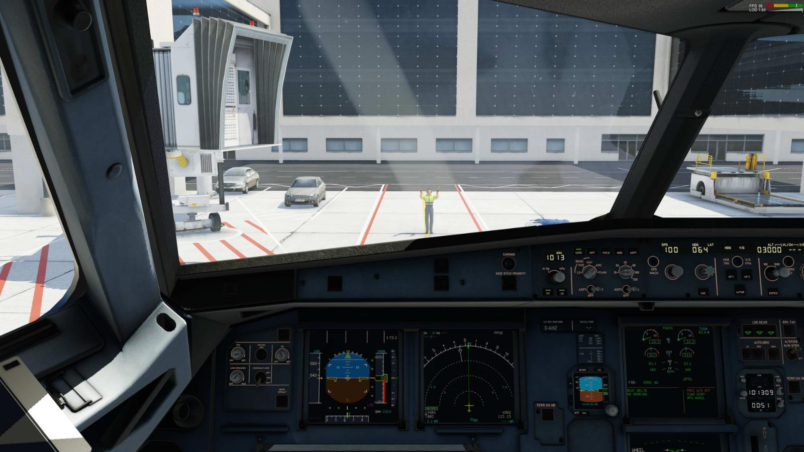
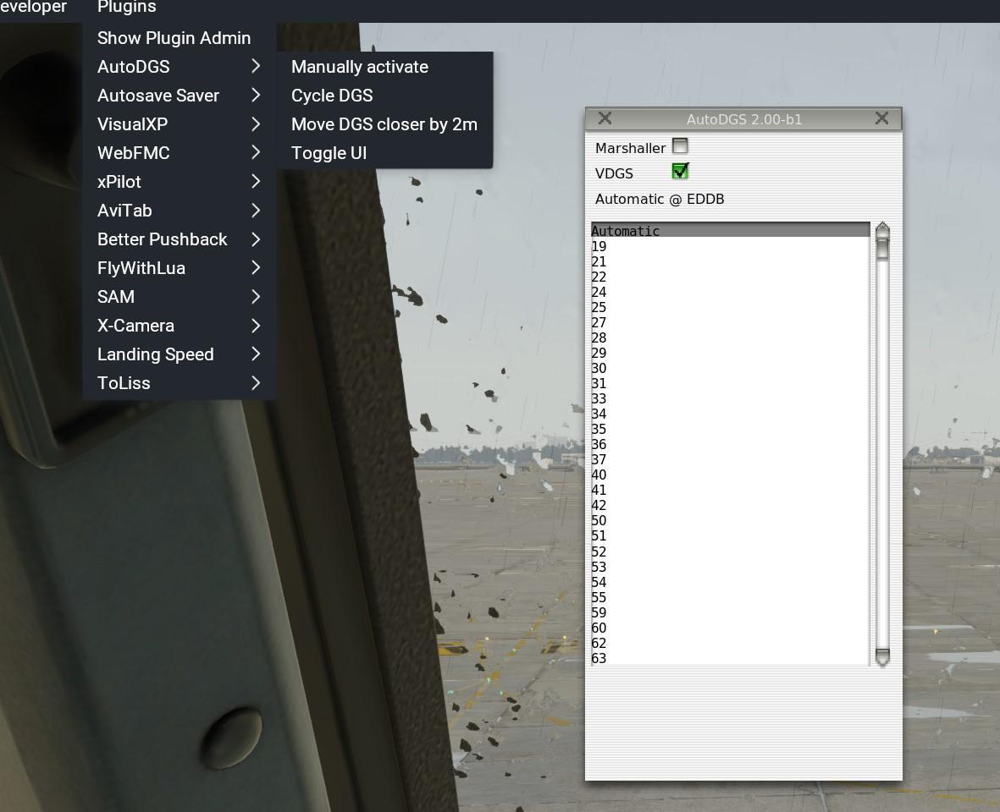

# AutoDGS
Automatically provide DGS service (Marshaller or VDGS) for X Plane's Global Scenery airports.

Well, not every airport. As you don't want to have Marshallers and Safedock VDGS' at your rural landing strip the airport must have at least one instrument approach resulting in 6000+ airports.
It works for XP11 and XP12.

Download link: https://github.com/hotbso/AutoDGS/releases

Just drop the plugin in the plugins folder and you are in automatic set-and-forget mode.

Support Discord: https://discord.gg/7GNmbFkyXt

## Automatic Mode
After you LAND (= some air time!) on an airport the plugin activates and searches actively for suitable ramps in the direction that you are taxiing.
Note that you MUST have your beacon on (a no-brainer with engine on, right?).

The plugin automatically detects which stands have a jetway and selects a VDGS for these and the Marshaller for others.

When close enough to a stand the selected DGS appears and gives appropriate guidance information. The distance to the DGS is automatically adjusted according to the pilot's eye height AGL.
With the command "Cycle DGS" bound to a key or button or through the menu you can cycle between Marshaller or VDGS as you like.
Should the DGS be hidden by wall or run over by ground traffic you can pull it forward in 2m increments with the command or menu entry "Move DGS closer by 2m".
Once parked and the beacon is off the plugin removes the DGS, docks a jetway (XP12 only!) if there is one and deactivates.

See the plugin in action in a short video (of a prerelease version) -> https://www.youtube.com/watch?v=lzujmsCWF6w .

If you don't like automatic activation or automatic docking of the jetway see the FAQ.

## Preselect Mode
When on ground you can preselect a stand in the GUI (e.g. after you get a stand assigned on VATSIM).

## Helicopter support
For helicopters the plugin activates when you are below 10m AGL for at least 10 seconds. Note that guidance signals are the same as for fixed wing aircrafts.

 

## FAQ

### I just want to test it and nothing happens. What now?
Possible reasons are:

Your beacon is off. So the plugin deactivates immediately.
You did not arrive with a flight. In this case you must activate the plugin with command/menu "Manually activate".
You use XRAAS with the XP12 work around. This makes the copied Global Airports a "Custom Scenery". See below.
You are on a Custom Scenery. See "How do I enable a Custom Scenery?".

### Does it coexist with SAM or AutoGate?
Absolutely, but not on the same scenery.

### What about Custom Sceneries?
All custom sceneries that are not SAM-enabled (= have a sam.xml file) are automatically activated for AutoDGS.
If you don't want such activation for a specific scenery (e.g. a scenery using AutoGate) you must place a file named "no_autodgs" in the scenery's top directory.
If want to force activation even for a SAM-enabled scenery place a file "use_autodgs" in the scenery's top directory.

If you have problems with creating a file without extension you can create  .txt files as well, e.g. "no_autodgs.txt".

### I don't like automatic mode, what can I do?
In this case you can control activation with a lua script.
See the sample file "AutoDGS/lua_sample/autodgs_activate_on_taxi_light_off.lua".
As the name suggests it activates the plugin on "taxi light off". You can use any switch or state your favorite plane provides.

### I don't like automatic docking of the jetway as it conflicts e.g. with Zibo's ground handling, what can I do?
Add the ICAO code of your plane to file "acf_dont_connect_jetway.txt" and jetways will no longer be connected by AutoDGS.

### I have a specific plane that does not work at all, what to do?
It's likely that this plane does not use the "beacon" datarefs in a standard way. Enter the ICAO code of the plane into "acf_use_engine_running.txt" and the plugin will "engine running" instead of "beacon".

# Credits
Jonathan Harris (aka Marginal) (https://github.com/Marginal) for creating Autogate\
@cxn0026 for explaining how Marshallers and VDGS really use guidance signals\
@Papickx + @cxn0026 for providing better textures and day + night lighting

## License
Please observe that this project is covered by various licenses.

### The objects and textures and source code of Autogate by Marginal:
-- copy of license remark from https://github.com/Marginal/AutoGate ---\
The plugin code in the src directory is licensed under the GNU LGPL v2.1 license.\
The rest of the kit is licensed under the Creative Commons Attribution license. In short, you can use any part of this kit (including the 3D objects and their textures) in original or modified form in a free or commerical scenery package, but you must give the author credit.

### Contributions by hotbso:
This is in parts a derived work from libacfutils and Autogate so the above mentioned licenses apply accordingly to the components of this project.
